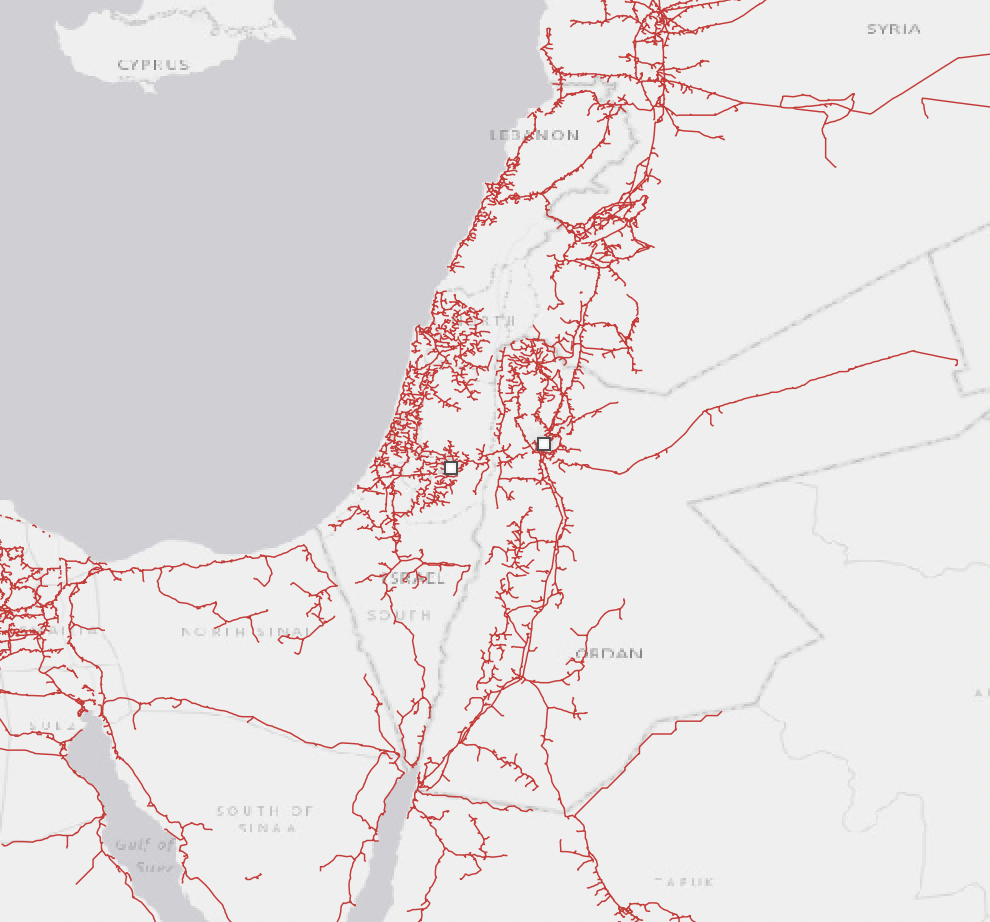

Our suite of data sets focus on the electricity and water sectors of Israel, Palestine and Jordan. These data feed into data platforms that could help regional decision-makers to understand the transboundary dynamics of their system. For example, users can visualise the energy and water sectors are a system scale, track the impacts of socioeconomic and environmental drivers, and examine risks and opportunities associated with transboundary issues.

## Platforms
Below is a list of our open-access data platforms related to regional energy and water systems.

---

### Energy

This is a bulleted list:

*  first item
*  second item
*  third item

 * Transmission Watch: *visualise electricity transmission infrastructure* [[Launch]]((https://prototype-omstbrm-webpage-osiris.netlify.app))

### Water

* **Water Watch**: mapping critical water assets (e.g., treatment plans, dams etc.) in the region [LAUNCH](https://prototype-omstbrm-webpage-osiris.netlify.app)
* **Basin Explorer**: explore key water basins in the Jordan valley [LAUNCH](https://prototype-omstbrm-webpage-osiris.netlify.app)

<!-- 

 -->